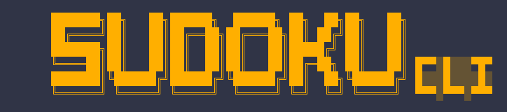

# Sudoku Solver cli



A terminal-based Sudoku solver with image recognition support. Load a puzzle by typing it in, or point it at a photo and let it read the board for you.

## Requirements

- [uv](https://docs.astral.sh/uv/getting-started/installation/)
- Python 3.12+

**Linux only:** OpenCV requires a display library:

```bash
sudo apt install libgl1
```

## Installation & running

```bash
git clone https://github.com/ammac123/SudokuSolverCLI
cd sudoku
./main.sh
```

`uv` handles creating a virtual environment and installing all dependencies automatically. On the first run, EasyOCR will download its model weights (~93MB) to `src/models/`.

## Usage

Run with `./main.sh`. From the main menu you can:

- **Enter a puzzle manually** — type in the clues via the terminal
- **Load from image** — provide a path to a photo of a Sudoku grid
- **Solve** — run the solver against the current board
